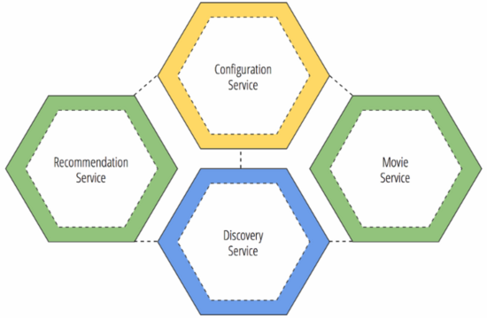

### 概要介绍

- 分布式配置管理应该是分布式系统和微服务应用的第一步。想象一下如果你有几十个服务或应用需要配置，而且每个服务还分为开发、测试、生产等不同维度的配置，那工作量是相当大的，而且还容易出错。如果能把各个应用的配置信息集中管理起来，使用一套机制或系统来管理，那么将极大的提高系统开发的生产效率，同时也会提高系统开发环境和生产环境运行的一致性。
  



### 搭建步骤
1.   在git服务器上创建一个项目用于存放配置文件
  > - 文件命名规范: 如 fincar-account-test.properties
  > - 可以分成两部分: {application}- {profile}.properties
  > - profile
  > - dev-开发环境
  > - test-测试环境
  > - 建议采用bootstrap+application组合形式，一般bootstrap配置工程不可变参数，且在启动时需要设定的内容，application配置可变参数


  > - {application} 匹配客户端的 “spring.application.name”
  > - {profile} 匹配客户端的”spring.active.profiles”
  > - {label} 如果是svn匹配trunk/branchs等.

1.   创建spring cloud配置服务器
  > - @EnableConfigServer
  > - 搭建好后可以访问 http://localhost:8888/{application}/{profile}/{label}
  > - 如 http://127.0.0.1:8888/fincar-account/test
  > - 192.168.3.:8001/ddsc-account/test/DEV20170301

  1. 客户端使用该配置中心
  ```
    <dependency>
      <groupId>org.springframework.cloud</groupId>
      <artifactId>spring-cloud-config-client</artifactId>
    </dependency>
  ```

  ```
    bootstrap.properties 配置文件
    spring.cloud.config.uri=http://127.0.0.1:${config.port:8888}
    spring.cloud.config.name=fincar-account
    spring.cloud.config.profile=${config.profile:test}
  ```
> - 其中config.uri指定远程加载配置信息的地址，就是前面我们刚建立的配置管理服务器的地址，绑定端口8888，其中config.port:8888，表示如果在命令行提供了config.port参数，我们就用这个端口，否则就用8888端口。config.name表示配置文件名称，查看我们前面创建配置文件，是这个名称：
> - cloud-config-dev.properties
> - 可以分成两部分: {application}- {profile}.properties
> - 所以我们配置config.name为cloud-config，config.profile为dev，其中dev表示开发配置文件，配置文件仓库里还有一个测试环境的配置文件，切换该配置文件只需要将dev改为test即可，当然这个参数也可以由启动时命令行传入，如：
> - java -jar cloud-simple-service-1.0.0.jar --config.profile =test
> - 此时应用就会加载测试环境下的配置信息。

  1. 使用配置文件 @Value("${my.name}")
  2. 打开刷新
> - 在客户端的bootstrap.properties 启动配置刷新
> - @RefreshScope
> - endpoints.restart.enabled=true
> - endpoints.refresh.enabled=true
> - 访问 127.0.0.1:2225/refresh

----
- git参考网站

  - [GIT学习网站](http://blog.jobbole.com/53573/)
  - [让你的Git水平更上一层楼的10个小贴士](http://os.51cto.com/art/201408/448580.htm)

- cloud config参考网站

  - [spring boot 官网](http://docs.spring.io/spring-boot/docs/1.2.3.RELEASE/reference/html/index.html)
  - [Spring Cloud](http://projects.spring.io/spring-cloud/spring-cloud.html)
  - [Externalized Configuration](http://docs.spring.io/spring-boot/docs/1.2.3.RELEASE/reference/html/boot-features-external-config.html)
  - [What is Spring Cloud Config](http://qiita.com/making@github/items/704d8e254e03c5cce546)
  - [使用spring cloud实现分布式配置管理](http://www.cnblogs.com/skyblog/p/5129603.html)
  - [Spring cloud项目实践 配置中心和服务注册中心](http://sail-y.github.io/2016/03/21/Spring-cloud%E9%A1%B9%E7%9B%AE%E5%AE%9E%E8%B7%B5-%E4%BA%8C/)
  - [开始Spring Cloud Config](http://www.itnose.net/detail/6358908.html)
  - [Spring Boot 属性配置和使用](http://blog.csdn.net/isea533/article/details/50281151)
  - [SpringCloud：分布式配置服务器 ConfigServer](http://www.tuicool.com/articles/ZFFfQj)
  - [spring boot 参考指南](https://qbgbook.gitbooks.io/spring-boot-reference-guide-zh/content/III.%20Using%20Spring%20Boot/20.%20Packaging%20your%20application%20for%20production.html)
----
