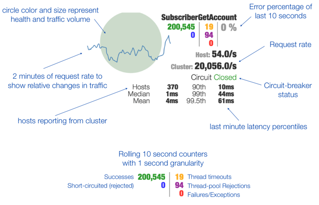

### 步骤
1. 引入依赖
```

  <!--hystrix-->
    <dependency>
        <groupId>org.springframework.cloud</groupId>
        <artifactId>spring-cloud-starter-hystrix</artifactId>
    </dependency>

    <!--hystrix-dashboard 监控-->
    <dependency>
        <groupId>org.springframework.cloud</groupId>
        <artifactId>spring-cloud-starter-hystrix-dashboard</artifactId>
    </dependency>
```

1. 启动监控
- 使用EnableCircuitBreaker或者 EnableHystrix 表明Spring boot工程启用hystrix,两个注解是等价的.

  ```
  @SpringBootApplication
  @EnableCircuitBreaker
  @EnableHystrixDashboard

  ```
- HystrixCommand 表明该方法为hystrix包裹，可以对依赖服务进行隔离、降级、快速失败、快速重试等等hystrix相关功能

  ```
  @Component
  public class CallDependencyService {

      private Random random = new Random();
      /**
       * 模拟获取用户信息(通过网络调用)
       * @return
       */
      @HystrixCommand(fallbackMethod = "fallback")
      public String mockGetUserInfo(){
          int randomInt= random.nextInt(10) ;
          if(randomInt<8){  //模拟调用失败情况
              throw new RuntimeException("call dependency service fail.");
          }else{
              return "UserName:liaokailin;number:"+randomInt;
          }
      }

      public String fallback(){
          return "some exception occur call fallback method.";
      }
  }

  ```
1. [访问监控](http://localhost:8080/hystrix-dashboard-1.5.4/)

- fallbackMethod 降级方法
  - commandProperties 普通配置属性，可以配置HystrixCommand对应属性，例如采用线程池还是信号量隔离、熔断器熔断规则等等
  - ignoreExceptions 忽略的异常，默认HystrixBadRequestException不计入失败
  - groupKey() 组名称，默认使用类名称
  - commandKey 命令名称，默认使用方法名
  - 上面的配置完成后启动应用就可以访问 http://localhost:3334/hystrix.stream 不过返回的是报文，后面使用Dashboard 来提供图形化

### Dashboard

> - circle color and size represent health and traffic volume
> - 2 minutes of request rate to show relative changes in traffic
> - hosts reporting from cluster
> - error percentage of last 10 seconds
> - request rate
> - circuit breaker status
> - last minute latency percentiles
----
> - 圆的颜色和大小代表健康和交通量
> - 2分钟的请求率显示流量的相对变化
> - 从集群报告主机
> - 最后10秒的误差百分比
> - 请求速率
> - 断路器状态
> - 最后一分钟的延迟百分

- [访问地址](http://localhost:8080/hystrix-dashboard-1.5.4/)
----


### spring-boot-admin

 


- 参考网站

[SpringBoot四大神器之Actuator](https://segmentfault.com/a/1190000004318360?_ea=568366)

 [Spring Boot Admin 的使用](http://blog.csdn.net/kinginblue/article/details/52132113)  这篇比较详细  里面还有各种配置信息

[Spring Boot Admin的使用](http://www.jianshu.com/p/e20a5f42a395)  

[Spring Boot应用的健康监控](http://www.jianshu.com/p/734519d3c383)

[杜琪](http://www.jianshu.com/users/28d7875c78df/latest_articles)  这个博客有很多内容

[Spring-boot-admin功能说明](http://blog.csdn.net/xingfulangren/article/details/52304413)

[spring-boot监控](http://boot.ren/2015/08/26/spring-boot%E7%9B%91%E6%8E%A7/)

[Spring-boot-admin github](https://github.com/codecentric/spring-boot-admin)

[github网站](https://github.com/codecentric/spring-boot-admin)


### 参考网站

- [github上的项目文档](https://github.com/Netflix/Hystrix/wiki/Metrics-and-Monitoring)
- [Hystrix github上的文档](https://github.com/Netflix/Hystrix/wiki)
- [SpringCloud微服务实战](https://segmentfault.com/a/1190000005142460#articleHeader4)
- [springcloud(第四篇)springcloud hystrix](http://blog.csdn.net/liaokailin/article/details/51339357)
- [使用Hystrix守护应用](http://ningandjiao.iteye.com/blog/2171849)
- [Hystrix 使用与分析](http://hot66hot.iteye.com/blog/2155036)
- [微服务中一个监控Spring Boot的神器](http://mp.weixin.qq.com/s?__biz=MzA5MzQ2NTY0OA==&mid=2650796673&idx=1&sn=fedb8cc30c8cd621d42e67393d9eb326&chksm=88562fdebf21a6c8f4f790ca1dc9f311a1d929d85d49471d6962fb2548793582b1c79a87a96a&mpshare=1&scene=1&srcid=0325xyyAqBGK0XyhxwIff9T3#rd)
